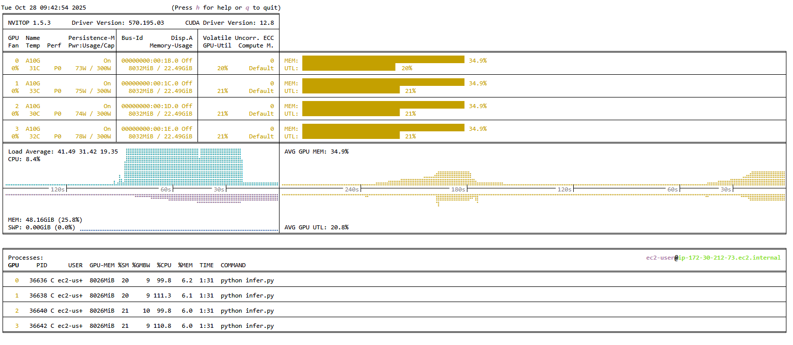
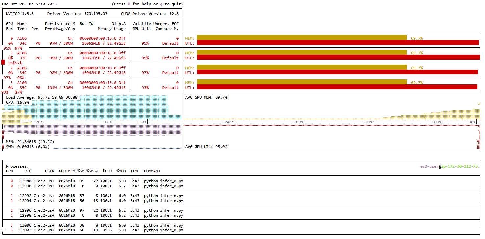

# DeepSeek-OCR Inference Scripts

[](https://github.com/connectaman/deepseek-ocr-multigpu-infer)
[](https://opensource.org/licenses/MIT)
[](https://www.python.org/)

Professional, production-ready Python scripts for running DeepSeek-OCR inference. This repository provides both single GPU and multi-GPU inference options to suit different hardware configurations and use cases.

**Repository**: [https://github.com/connectaman/deepseek-ocr-multigpu-infer](https://github.com/connectaman/deepseek-ocr-multigpu-infer)


## Scripts Available

### 1. Single GPU Inference (`deepseek_ocr_inference.py`)
- 🎯 **Single GPU**: Optimized for single GPU setups
- ⚡ **Fast Setup**: Quick model loading and processing
- 🔧 **Model Presets**: Built-in presets for different model sizes
- 📝 **Crop Mode**: Optional crop mode for better performance
- 🔄 **Multi-Process**: Support for 1-2 processes per GPU for maximum utilization

### 2. Multi-GPU Inference (`deepseek_ocr_multigpu_inference.py`)
- 🚀 **Multi-GPU Support**: Automatically detects and utilizes all available CUDA GPUs
- 📁 **Parallel Processing**: Processes entire folders of images in parallel
- ⚖️ **Load Balancing**: Efficiently distributes work across GPUs
- 📊 **Scalable**: Scales with your hardware
- 🔄 **Multi-Process**: Support for 1-2 processes per GPU for maximum utilization

## Common Features

- 📁 **Batch Processing**: Processes entire folders of images
- 🔧 **Configurable**: Customizable prompts, image sizes, and processing parameters
- 📊 **Progress Tracking**: Real-time logging and progress monitoring
- 📈 **Results Export**: Excel export of processing results and statistics
- 🛡️ **Error Handling**: Robust error handling with detailed logging
- 📝 **Professional Logging**: Clean, informative logging without experimental metrics

## Requirements

- Python 3.8+
- CUDA-compatible GPU(s)
- NVIDIA drivers and CUDA toolkit

## Installation

1. **Clone or download this repository**
   ```bash
   git clone https://github.com/connectaman/deepseek-ocr-multigpu-infer.git
   cd deepseek-ocr-multigpu-infer
   ```

2. **Create a virtual environment (recommended)**
   ```bash
   python -m venv venv
   source venv/bin/activate  # On Windows: venv\Scripts\activate
   ```

3. **Install dependencies**
   ```bash
   pip install -r requirements.txt
   ```

## 🚀 Inference Approaches

This repository supports **4 different inference approaches** to maximize GPU utilization and processing speed:

### 1. Single GPU - Single Process
- **Use Case**: Basic single GPU setups, testing, or when you want simple processing
- **Command**: `python deepseek_ocr_inference.py input_folder output_folder`
- **Processes**: 1 process on 1 GPU
- **Best For**: Simple setups, testing, or when you have limited GPU memory

### 2. Single GPU - Multi Process
- **Use Case**: Maximum utilization of a single powerful GPU
- **Command**: `python deepseek_ocr_inference.py input_folder output_folder --num-processes 2`
- **Processes**: 2 processes on 1 GPU
- **Best For**: High-end single GPU setups (RTX 4090, A100, etc.)

### 3. Multi-GPU - Single Process per GPU
- **Use Case**: Multiple GPUs with standard utilization
- **Command**: `python deepseek_ocr_multigpu_inference.py input_folder output_folder`
- **Processes**: 1 process per GPU
- **Best For**: Multi-GPU setups with moderate processing needs

### 4. Multi-GPU - Multi Process per GPU
- **Use Case**: Maximum utilization across multiple GPUs
- **Command**: `python deepseek_ocr_multigpu_inference.py input_folder output_folder --num-processes-per-gpu 2`
- **Processes**: 2 processes per GPU (e.g., 4 processes on 2 GPUs)
- **Best For**: High-performance multi-GPU setups for maximum throughput

## Usage

### Single GPU Inference

#### Basic Usage
```bash
python deepseek_ocr_inference.py input_folder output_folder
```

#### Advanced Usage
```bash
python deepseek_ocr_inference.py ./images ./results \
    --prompt "Convert this document to markdown" \
    --base-size 1024 \
    --image-size 640 \
    --crop-mode \
    --gpu-id 0 \
    --num-processes 2 \
    --results-file my_results.xlsx
```

#### Multi-Process Usage (Maximum GPU Utilization)
```bash
python deepseek_ocr_inference.py ./images ./results --num-processes 2
```

#### Model Size Presets
```bash
# Tiny model (fastest, least accurate)
python deepseek_ocr_inference.py input output --base-size 512 --image-size 512 --no-crop-mode

# Small model
python deepseek_ocr_inference.py input output --base-size 640 --image-size 640 --no-crop-mode

# Base model (default)
python deepseek_ocr_inference.py input output --base-size 1024 --image-size 1024 --no-crop-mode

# Large model (most accurate, slowest)
python deepseek_ocr_inference.py input output --base-size 1280 --image-size 1280 --no-crop-mode

# Gundam model (balanced)
python deepseek_ocr_inference.py input output --base-size 1024 --image-size 640 --crop-mode
```

### Multi-GPU Inference

#### Basic Usage
```bash
python deepseek_ocr_multigpu_inference.py input_folder output_folder
```

#### Advanced Usage
```bash
python deepseek_ocr_multigpu_inference.py ./images ./results \
    --prompt "Convert this document to markdown" \
    --base-size 1024 \
    --image-size 1280 \
    --num-processes-per-gpu 2 \
    --results-file multigpu_results.xlsx
```

#### Multi-Process per GPU (Maximum Utilization)
```bash
python deepseek_ocr_multigpu_inference.py ./images ./results --num-processes-per-gpu 2
```

### Command Line Arguments

#### Single GPU Script (`deepseek_ocr_inference.py`)

| Argument | Required | Default | Description |
|----------|----------|---------|-------------|
| `input_folder` | ✅ | - | Path to folder containing input images |
| `output_folder` | ✅ | - | Path to folder for output markdown files |
| `--prompt` | ❌ | `"<image>\n<|grounding|>Convert the document to markdown. "` | Custom prompt for OCR model |
| `--base-size` | ❌ | `1024` | Base size parameter for model |
| `--image-size` | ❌ | `640` | Image size parameter for model |
| `--crop-mode` | ❌ | `False` | Enable crop mode for processing |
| `--gpu-id` | ❌ | `0` | GPU device ID to use |
| `--num-processes` | ❌ | `1` | Number of processes on GPU (1-2) |
| `--results-file` | ❌ | `single_gpu_inference_results.xlsx` | Excel file for processing results |

#### Multi-GPU Script (`deepseek_ocr_multigpu_inference.py`)

| Argument | Required | Default | Description |
|----------|----------|---------|-------------|
| `input_folder` | ✅ | - | Path to folder containing input images |
| `output_folder` | ✅ | - | Path to folder for output markdown files |
| `--prompt` | ❌ | `"<image>\n<|grounding|>Convert the document to markdown. "` | Custom prompt for OCR model |
| `--base-size` | ❌ | `1024` | Base size parameter for model |
| `--image-size` | ❌ | `1280` | Image size parameter for model |
| `--num-processes-per-gpu` | ❌ | `1` | Number of processes per GPU (1-2) |
| `--results-file` | ❌ | `multigpu_inference_results.xlsx` | Excel file for processing results |

### Supported Image Formats

- JPEG (.jpg, .jpeg)
- PNG (.png)
- BMP (.bmp)
- TIFF (.tiff, .tif)
- WebP (.webp)

## GPU Monitoring

### Install GPU Monitoring Tool

```bash
pip install nvitop
```

### Monitor GPU Usage

```bash
nvitop
```

This will show real-time GPU utilization, memory usage, and temperature for all available GPUs.

#### GPU Monitoring Screenshot




*Example of nvitop showing GPU utilization during DeepSeek-OCR inference across multiple GPUs*

## Example Workflow

### Single GPU Workflow

1. **Prepare your images**
   ```bash
   mkdir input_images
   # Copy your images to input_images/
   ```

2. **Run single GPU inference**
   ```bash
   python deepseek_ocr_inference.py input_images output_markdowns
   ```

3. **Monitor progress**
   - Watch the console output for real-time progress
   - Use `nvitop` in another terminal to monitor GPU usage

4. **Check results**
   - Markdown files will be saved in `output_markdowns/`
   - Processing results will be saved in `single_gpu_inference_results.xlsx`

### Multi-GPU Workflow

1. **Prepare your images**
   ```bash
   mkdir input_images
   # Copy your images to input_images/
   ```

2. **Run multi-GPU inference**
   ```bash
   python deepseek_ocr_multigpu_inference.py input_images output_markdowns
   ```

3. **Monitor progress**
   - Watch the console output for real-time progress
   - Use `nvitop` in another terminal to monitor GPU usage across all GPUs

4. **Check results**
   - Markdown files will be saved in `output_markdowns/`
   - Processing results will be saved in `multigpu_inference_results.xlsx`

## Output Structure

### Markdown Files
Each input image generates a corresponding markdown file:
```
input_images/
├── document1.jpg
├── document2.png
└── document3.tiff

output_markdowns/
├── document1.md
├── document2.md
└── document3.md
```

### Results Excel File
The Excel file contains processing metadata:
- `filename`: Original image filename
- `markdown_filename`: Generated markdown filename
- `gpu_id`: GPU that processed the image
- `gpu_name`: Name of the GPU used
- `status`: Processing status (success/error)
- `error`: Error message (if applicable)

## 📊 Performance Comparison

### Processing Speed (Approximate)
| Approach | GPU Setup | Processes | Use Case | Speed |
|----------|-----------|-----------|----------|-------|
| Single GPU - Single Process | 1 GPU | 1 | Basic processing | 1x |
| Single GPU - Multi Process | 1 GPU | 2 | High-end single GPU | 1.5-1.8x |
| Multi-GPU - Single Process | 2+ GPUs | 1 per GPU | Standard multi-GPU | 2x (2 GPUs) |
| Multi-GPU - Multi Process | 2+ GPUs | 2 per GPU | Maximum throughput | 3-3.5x (2 GPUs) |

### Memory Requirements
- **Single Process**: ~8-12GB GPU memory per process
- **Multi Process**: ~6-8GB GPU memory per process (due to shared model loading)
- **Recommended**: RTX 4090 (24GB) or A100 (40GB) for multi-process setups

### When to Use Each Approach
1. **Single GPU - Single Process**: Testing, development, or limited GPU memory
2. **Single GPU - Multi Process**: High-end single GPU with plenty of memory
3. **Multi-GPU - Single Process**: Multiple GPUs with standard processing needs
4. **Multi-GPU - Multi Process**: Production environments requiring maximum throughput

## Performance Tips

### Single GPU Optimization
1. **Model Size**: Choose appropriate model size based on your accuracy vs speed requirements
2. **Crop Mode**: Enable crop mode for better performance on smaller images
3. **GPU Selection**: Use `--gpu-id` to select the most powerful GPU if you have multiple
4. **Memory Management**: Monitor GPU memory usage with `nvitop`

### Multi-GPU Optimization
1. **Load Balancing**: The script automatically distributes work evenly across GPUs
2. **GPU Memory**: Ensure sufficient GPU memory on all GPUs for your batch size
3. **Image Size**: Larger images require more memory but may provide better OCR results
4. **Monitoring**: Use `nvitop` to monitor GPU utilization across all GPUs

### General Tips
1. **Batch Processing**: Process images in batches to optimize memory usage
2. **Image Formats**: Use compressed formats (JPEG) for faster loading
3. **Storage**: Use SSD storage for faster image loading

## Troubleshooting

### Common Issues

1. **CUDA Out of Memory**
   - Reduce `--image-size` parameter
   - Process fewer images simultaneously
   - Check available GPU memory with `nvidia-smi`

2. **No Images Found**
   - Verify input folder path
   - Check supported image formats
   - Ensure images are not in subdirectories

3. **Model Loading Errors**
   - Verify internet connection for model download
   - Check CUDA installation
   - Ensure sufficient disk space for model cache

### Debug Mode

For detailed debugging, you can modify the logging level in the script:
```python
logging.basicConfig(level=logging.DEBUG, ...)
```

## License

MIT License - see LICENSE file for details.

## 👨‍💻 Author

**Aman Ulla**
- 📫 Contact: [connectamanulla@gmail.com](mailto:connectamanulla@gmail.com)
- 🌐 Portfolio: [amanulla.in](http://www.amanulla.in)
- 🔗 [GitHub](https://github.com/connectaman) • [LinkedIn](https://linkedin.com/in/connectaman) • [Twitter](https://twitter.com/connectaman1)

## Contributing

Contributions are welcome! Please feel free to submit a Pull Request.

## Support

For issues and questions:
1. Check the troubleshooting section above
2. Review the console output for error messages
3. Open an issue on the repository

---

**Note**: This script requires CUDA-compatible GPUs and the DeepSeek-OCR model. Make sure your system meets the hardware requirements before running.
